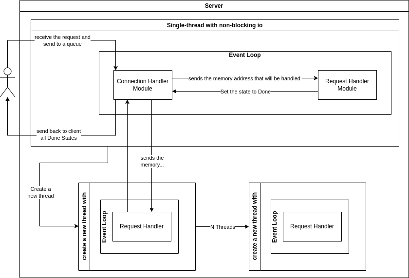

# Cortex Core
Generic Server - Efficient and flexible

---
Cortex-core is designed to work with high load and to be flexible to work with any protocol.

## Server architecture and modules

### Event-loop module:
Working on it...

### Connection Handler module:
Working on it...

### Request Handler module:
Working on it...

